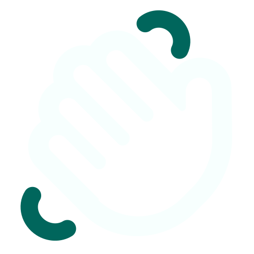

# Migawka

<h2>Narzędzie przekładające gesty języka migowego na tekst.</h2>

🔗 Link do strony: https://migawka-translator.vercel.app/

## 🤍 Stworzone na potrzeby konkursu [Hack Heroes 2022](https://hackheroes.pl/) przez zespół 3.5 Kacpra:

* Kasper Gaworski – programista frontend
* Kacper Krawczyński - projektant
* Kacper Królak – programista backend
* Kacper Szczęsny – programista AI

🔗 Cześć Backendowa aplikacji znajduje się w repozytorium pod linkiem: https://github.com/kacperkrolak/migawka-backend

## 👑 O projekcie

Migawka wychodzi naprzeciw problemom związanym z wykluczeniem obywatelskim wobec osób niemych lub głuchych, które posługują się językiem migowym. Osoby te bywają często niezrozumiane podczas prób komunikacji z użytkownikami mowy werbalnej, ograniczając się wyłącznie do wymiany informacji za pomocą tekstu. Doprowadza to do zjawiska wykluczenia społecznego, co niejednokrotnie uniemożliwia pełne uczestnictwo w życiu obywatelskim. Dzięki Migawce możliwe jest przekroczenie tych barier. 

  <table>
    <tr>
      <td align='center'>
        
      </td>
    </tr>
    <tr>
      <td align='center'>
        
      </td>
    </tr>
    <tr>
      <td align='center'>
        
      </td>
    </tr>
  </table>

Migawka przekłada gesty języka migowego nagrane poprzez kamerę na tekst. Użytkownik, który nie zna języka migowego, może w szybki i skuteczny sposób dowiedzieć się, co przekazuje mu osoba głucha/niema. Wierzymy, że nasz projekt znajdzie zastosowanie w sądach, urzędach i w czasie wystąpień publicznych.

## 🚀 Przyszłość Migawki

Mamy plany, aby za pomocą machine learningu wdrożyć do Migawki więcej gestów, możliwe, że nawet cały Polski Język Migowy, Amerykański Język Migowy i inne popularne języki gestykularne. Projektem mogłyby się zainteresować różne instytucje, np. urzędy czy banki, które mogłyby wykorzystać Migawkę jako pomoc w komunikacji z osobami głuchymi/niemymi. Naszym zdaniem każdy obywatel powinien móc bezproblemowo korzystać ze swoich praw oraz każdy obywatel bezproblemowo powinien egzekwować swoje prawa.

## 🛠 Użyte technologie frontend 

  <table>
    <tr>
      <td>
        
      </td>
      <td>
        
      </td>
      <td>
        
      </td>
      <td>
        
      </td>
    </tr>
     <tr>
      <td align='center'>
        Vite
      </td>
      <td align='center'>
        React
      </td>
      <td align='center'>
        Tailwind CSS
      </td>
      <td align='center'>
        Sass
      </td>
    </tr>
  </table>

## 🛠 Użyte technologie backend

  <table>
    <tr>
      <td>
        
      </td>
      <td>
        
      </td>
      <td>
        
      </td>
      <td width="25%">
        
      </td>
    </tr>
     <tr>
      <td width="25%" align='center'>
        Flask
      </td>
      <td width="25%" align='center'>
        Python
      </td>
      <td width="25%" align='center'>
        PyTorch
      </td>
      <td width="25%" align='center'>
        Detectron2
      </td>
    </tr>
  </table>

